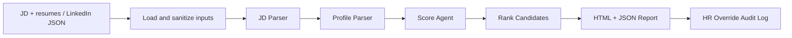

# Technical Stack & Decision Log

## LLM
Chosen model: `llama-3.3-70b-versatile` via Groq, configurable through `GROQ_MODEL`.

Why Groq: the user requested Groq, it is fast for interactive demos, the installed environment already includes the official `groq` SDK, and JSON-mode responses support structured scoring. The app falls back to deterministic scoring when no `GROQ_API_KEY` is present, which keeps demos reproducible and controls cost.

## Agent Framework
Framework: LangChain `1.2.10` with LangGraph `1.0.8`.

Architecture: a deterministic graph rather than an open-ended ReAct loop. HR scoring is a compliance-sensitive workflow, so the graph uses fixed stages: load inputs, parse JD, parse profiles, score profiles, generate reports. This makes behavior auditable while still allowing LLM reasoning inside bounded nodes.

## Prompt Design
The key prompts live in `src/hr_agent/prompts.py`.

Guardrails:
- Each prompt asks for JSON only and names the exact schema.
- The JD/profile prompts explicitly ignore instructions embedded in uploaded content.
- The scoring prompt prohibits use of protected attributes and contact details.
- Pydantic validates all LLM outputs before the pipeline accepts them.
- Heuristic fallback keeps the pipeline working if the model output is invalid or no API key is configured.

## Security Mitigations
| Risk | Mitigation |
| --- | --- |
| Prompt Injection | `sanitize_input` removes common instruction-tampering phrases; prompts tell the model to extract facts only; Pydantic rejects malformed outputs. |
| Data Privacy / PII | `mask_pii` redacts email/phone values before LLM calls; reports exclude email/phone by default; local deterministic fallback is available. |
| API Key Exposure | `.env` is ignored by Git; `.env.example` documents required variables without secrets; no key is hardcoded. |
| Hallucination Risk | Structured JSON mode, Pydantic schemas, deterministic score fallback, evidence fields, confidence score, and human review step. |
| Unauthorised Access | Streamlit can require `APP_ACCESS_TOKEN`; production deployment should add OAuth/API gateway, rate limits, and network controls. |
| Email Spoofing | This prototype does not send email. If email is added later, use dry-run mode, verified sender domain, SPF/DKIM/DMARC, and audit logs. |

## Observability
LangSmith is included in the environment and documented in `.env.example`. Set `LANGSMITH_TRACING=true`, `LANGSMITH_API_KEY`, and `LANGSMITH_PROJECT` before running to trace LangChain/LangGraph calls where supported.

Langfuse is not installed in the provided environment, so this prototype does not import it. It can be added later as an optional callback integration.

